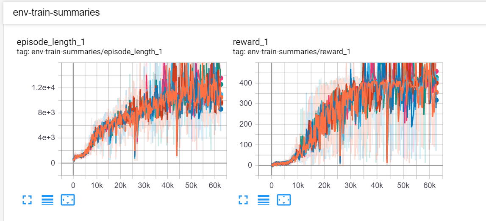
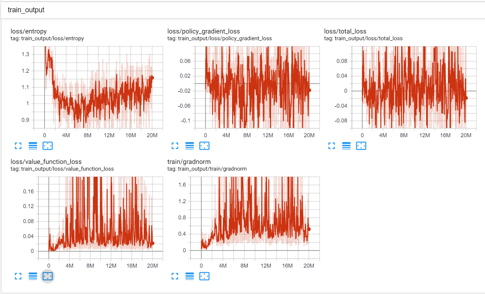

# A2C

This is a modified version of A2C (Advantage Actor Critic) based on Tensorflow. 

### Prerequisites
- Python 3 or above
- tensorflow 1.14
- gym 0.9.2

### performance
- PongNoFrameskip-v4

     
      Fig.1 Performance on PongNoFrameskip-v4

- BreakoutNoFrameskip-v4
It takes about 10 hours to run 2e7 steps on computer with 2 GPU 2080 Ti, Intel i9-9820X CPU (10 Cores) and 128 GB Memory. The algorithm takes about 4.5 hours to converge.

     
      Fig.3 Performance on BreakoutNoFrameskip-v4

You can also monitor the training process by type
`tensorboard --logdir=experiments/experiment_breakout/summaries --host localhost --port 8088` (on windows). or `tensorboard --logdir=experiments/experiment_breakout/summaries` (on Linux).

     
      Fig.4 Tensorboard plot of BreakoutNoFrameskip

### References
[1. OpenAI Baselines](https://github.com/openai/baselines)

[2. MG2033's Implementation](https://github.com/MG2033/A2C)

[3. cts198859's Implementation](https://github.com/cts198859/deeprl_signal_control)
